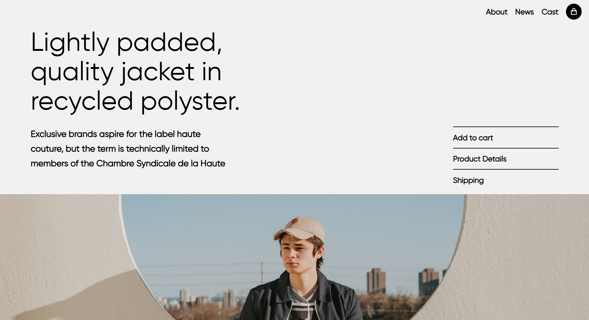
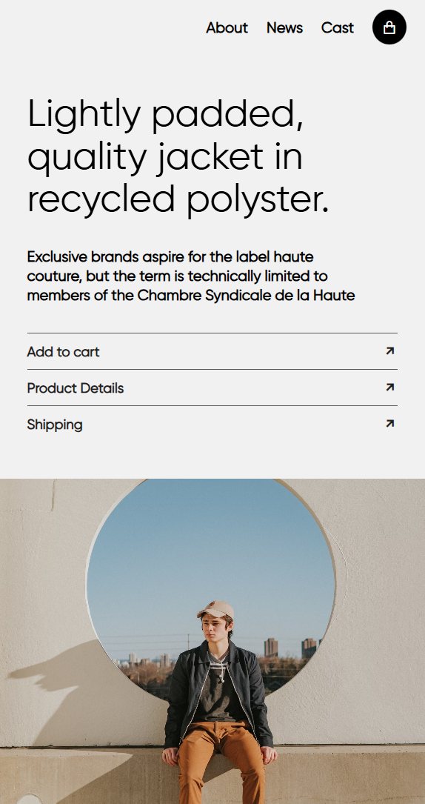

# Shop Jacket Responsive Website

Welcome to the **Shop Jacket Responsive Website**! This website is designed to showcase jackets with a fully responsive layout, ensuring an optimal viewing experience across all devices.

## Features

- **Responsive Design**: Adapts seamlessly to desktops, tablets, and mobile devices.
- **Modern UI**: Clean and visually appealing user interface.
- **Interactive Elements**: User-friendly navigation and interactive features.
- **Cross-Browser Compatibility**: Works on all modern browsers.
- **Optimized Performance**: Fast loading and smooth transitions.

## Technologies Used

- **HTML5**: Semantic and structured markup.
- **CSS3**: Advanced styling with Flexbox, Grid, and Media Queries.

## Setup and Usage

1. **Clone the Repository**:
   ```bash
   git clone https://github.com/kuldeep23/shop-jacket-website.git
   ```

2. **Navigate to the Project Directory**:
   ```bash
   cd shop-jacket-website
   ```

3. **Open the Website**:
   Open the `index.html` file in any modern web browser to view the website.

## Responsive Design Approach

- **Media Queries**: Tailored breakpoints for different screen sizes.
- **Flexible Layouts**: Using CSS Flexbox and Grid for adaptive layouts.
- **Mobile-First Approach**: Designed with small screens in mind and scaled up for larger devices.

## Screenshots

### Desktop View:


### Mobile View:


## Future Enhancements

- Add e-commerce functionality (e.g., shopping cart, checkout).
- Integrate a backend for dynamic content.
- Implement animations for better user engagement.
- Optimize for SEO and performance.

## Contributions

Contributions are welcome! Please fork the repository, create a feature branch, and submit a pull request.

## License

This project is licensed under the [MIT License](LICENSE).

---

Happy coding! If you have any questions or feedback, feel free to reach out.
